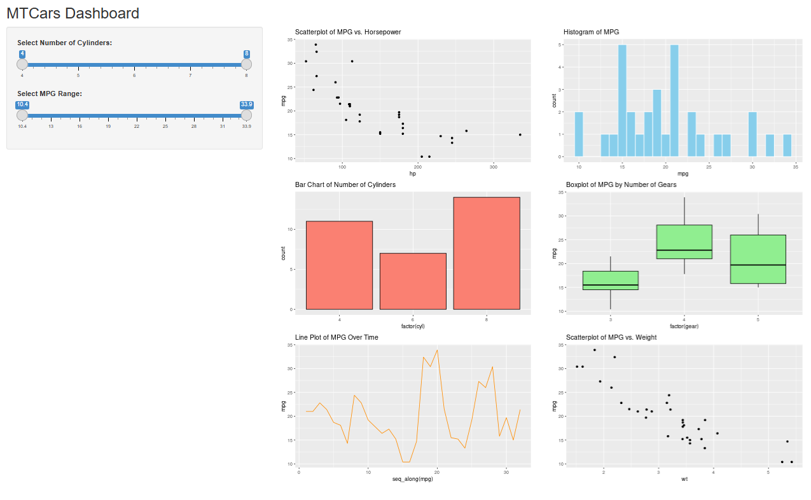

# MTCars Dashboard Shiny App



This project is an interactive dashboard built with [Shiny](https://shiny.rstudio.com/) in R, using the classic `mtcars` dataset. The dashboard allows users to explore various aspects of the dataset through dynamic plots and filterss.

## Features

- **Filter by Number of Cylinders and MPG Range:**  
  Use sliders to select the range of cylinders and miles per gallon (MPG) to focus your analysis.

- **Visualizations:**
  - Scatterplot of MPG vs. Horsepower
  - Histogram of MPG
  - Bar Chart of Number of Cylinders
  - Boxplot of MPG by Number of Gears
  - Line Plot of MPG Over Time
  - Scatterplot of MPG vs. Weight

## Getting Started

### Prerequisites

- R (version 4.0 or higher recommended)
- The following R packages:
  - shiny
  - dplyr
  - ggplot2

You can install the required packages with:

```r
install.packages(c("shiny", "dplyr", "ggplot2"))
```

### Running the App

1. Open `MTcars Dashboard Shinny app.R` in RStudio or your preferred R environment.
2. Run the app with:

```r
shiny::runApp("MTcars Dashboard Shinny app/MTcars Dashboard Shinny app.R")
```

Or simply click the "Run App" button in RStudio.

## Project Structure

- `MTcars Dashboard Shinny app.R` — Main Shiny app source code
- `README.md` — This file

## License

This project is for educational purposes.
